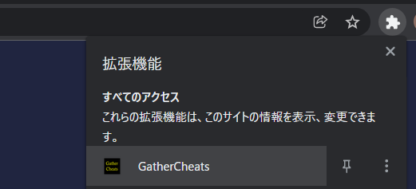
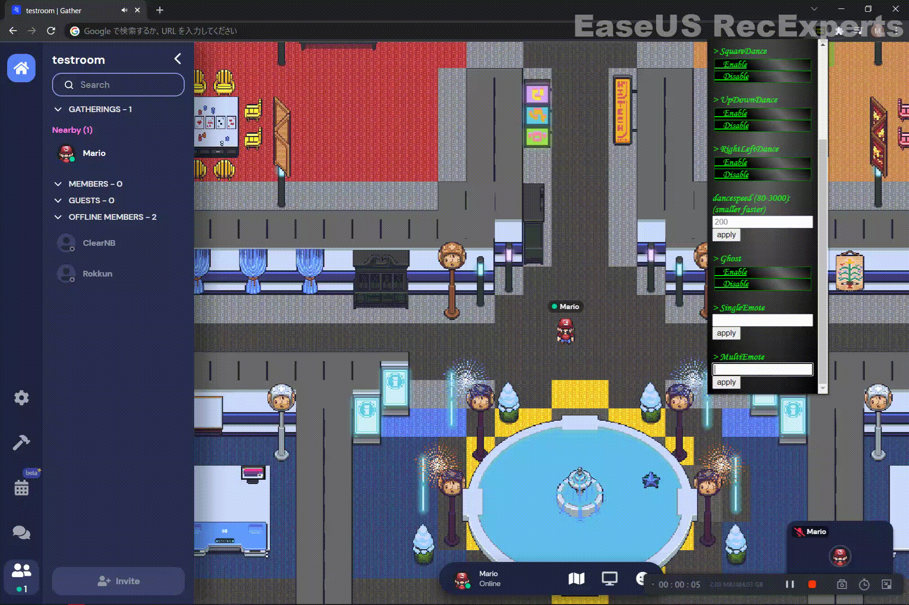
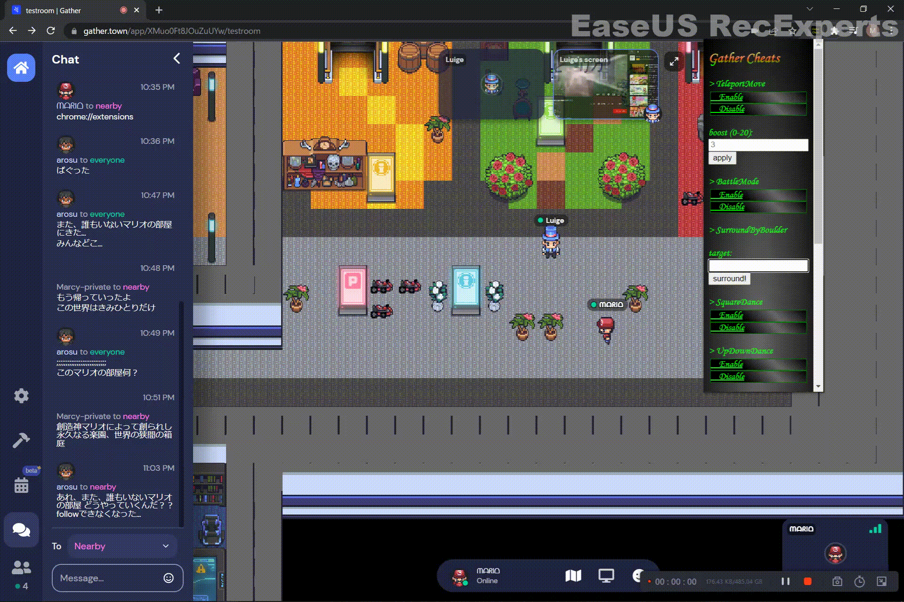
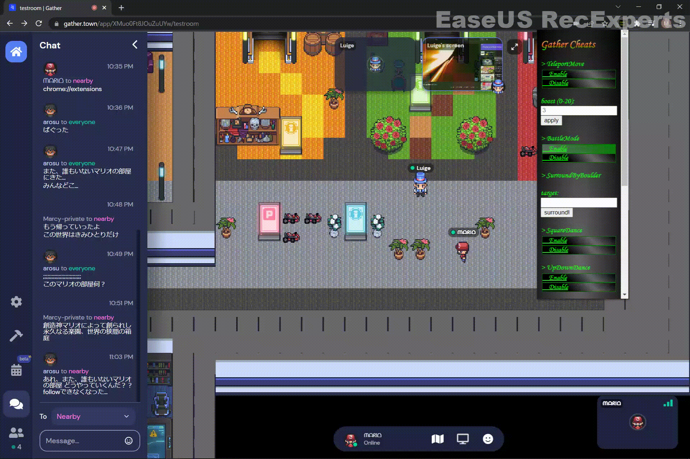

# Gather Cheats
Chrome Extensions that can let you become a hero in gather.town

## Demo
you can watch demo video from [here](src/GatherCheatsDemo.mp4)

## Install
1. open chrome and access `chrome://extensions`
2. toggle `developer mode` on
3. git clone or download this repo and drag&drop the whole folder
4. open gather and become a hero

## Usage
On gather, click on this extention like the image below.  
  
Then the menu will show up. Each function's descriptions are below.

 

### teleport move

by enabling, you can move through anywhere (even walls) by arrow keys.  
(you can still move normally by wasd key)

#### boost
boost is how fast you can move by teleport move.  
enter the number and click apply button to change the boost.

 

### dance

there are square/updown/rightleft dance.  
you can enable it to make your character dance.  

#### dancespeed
enter the number and click apply button to modify the speed.  
notice that the smaller the number, faster the speed.

 

### ghost

in gather, you have to press `g` for the whole time, but with this extension,
you only have to click `Enable` onetime and disable it by clicking `Disable` one time.

 

### single emote

enter ONLY ONE character or emoji and click apply to show that input above the character.

### multi emote

enter some message in and click apply to show the message one character at a time above the character.

### Surround By Boulder

place boulders arround specified player! (enter player's name)  
※ 1 **there should be at least one "Boulder (2x2)" object in the map you're in**  
※ 2 you have to have permission to place object in the map

 

## BattleMode

### Boulder Magic

Enable this and you can use boulder magic to attack player by ijkl (i:up j:left k:down l:right).  
※ 1 **there should be at least one "Boulder (2x2)" object in the map you're in**  
※ 2 you have to have permission to place object in the map

